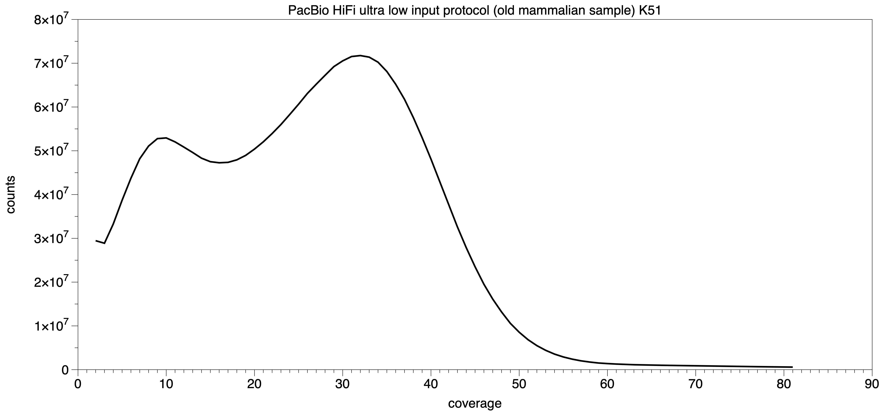
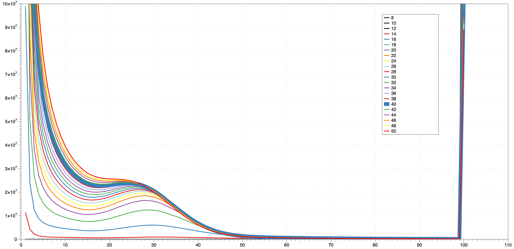
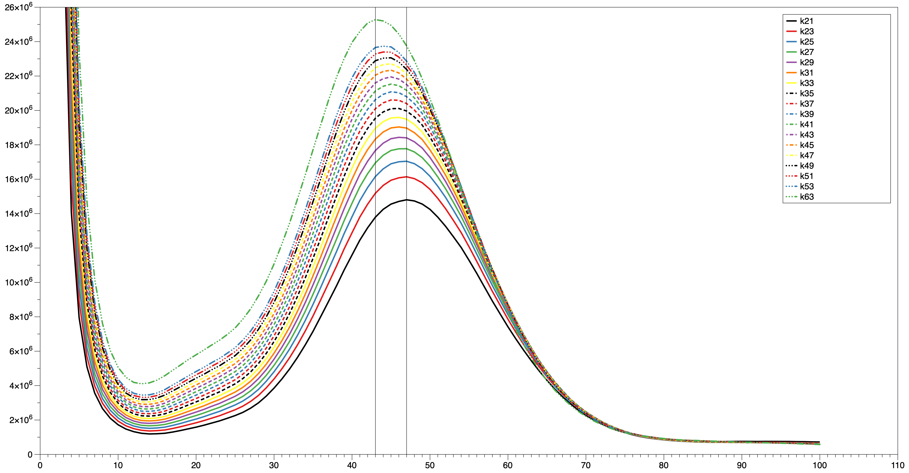

# Difficult examples 

1. Contaminated samples 

2. PacBio Ultra low input protocol

    a) HiFiams k51 logging - mammal, old sample, assembly is very fragmented N50: 300Kb, Busco C: ~80%

    

    b) HG002 PacBio UL reads (SRR12454519,SRR12454520), diploid sample, coverage 22

    |Name|contigs|yield(G)|N50(K)|N90(K)| Busco: v5.4.4, primates_odb10|
    |:---|-------:|--------:|------:|--------:|:------------------------|
    |Hap1| 12251  |	3.03    | 585 |112 |C:83.9%[S:80.9%,D:3.0%],F:3.6%,M:12.5%,n:13780|
    |Hap2| 12072  |	2.97    | 483 |108 |C:81.7%[S:79.3%,D:2.4%],F:4.0%,M:14.3%,n:13780|

    [!mHomSap_UltraLowInputPacBio.pdf](difficult/mHomSap_UltraLowInputPacBio.pdf)
    

3. Planarian samples

    FastK kmer histograms for wBdeCan - kmer range 8 - 50

    

    FastK kmer histograms for wSchNov - kmer range 21 - 63

    
