# Kmer-based analysis of sequencing data 

There are numerous kmer counters available that can be used to create kmer tables. A probably inclomplete list 
can found here:
 * [FastK](https://github.com/thegenemyers/FASTK)
 * [kat](https://github.com/TGAC/KAT)
 * [jellyfish](https://github.com/gmarcais/Jellyfish)
 * [meryl](https://github.com/marbl/meryl)

In principle they can be used quite interchangeably and only have marginal differences in runtime and memory footprint, 
as well as different default arguments. In order to derive useful estimates for `sequencing coverage and genome size`, `heterozygosity`, 
`repeat content`, and biases e.g. `contamination` the kmer database should be created wit the following options:
   1. include 1-copy kmers
   2. use a high maximum kmer count >= 1'000'000
   3. choose a good kmer size*
   4. minimum haploid coverage: ~20x

*) The selection of a good kmer size is not straight forward. 

* `k21` seems to be a good balance between repetetive elements vs sequencing error and heterozygosity [[mschatz](https://github.com/schatzlab/genomescope/issues/32)]. 
* the merqury git repo offers a small script `best_k.sh` to calculate a 'good' kmer size based on genome size and error rate [[merqury](https://github.com/marbl/merqury/blob/master/best_k.sh)]. For pacbio HiFi reads with average error rates within [0.1 - 0.5%] the estimated best kmer sizes are in a very narrow range [17,25] for haploid genomes ranging from 90M to 90G. 
* `k40` is used by FastK by default
* rule of thumb: for smaller genomes <500M a smaller kmer size (<20) should be tested as well

# Kmer-based analysis with FastK and MERQURY.FK ( Meryl + Genomescope2.0)

## Data set T2T PacBio HiFi

1. create kmer tables with FastK  

```bash 
cor=12
tim=12:00:00 
mem=50G
par=core
nam=FASTK_PB
acc="-A proj2022-5-333"
# reads SRR1129212[1234].fastq are linked to current working dir 
for k in 14 21 31 40 50 
do 
   mkdir -p t2t_pb_k${k}
   pushd t2t_pb_k${k}
   cmd1="${SG} FastK -v -T${cor} -NT2T_PB_k${k} -k${k} -t1 ../SRR1129212[1234].fastq"
   sbatch -c ${cor} ${acc} -n 1 -p ${par} --mem=${mem} --time=${tim} -J ${nam}_k${k} --wrap="echo \"${cmd1}\" && ${cmd1}"
   popd
done
```

Run statistics

input read set: ~55G

|  K  |  walltime  | CPUtime | MemPeak (Gb) | storage (Gb)  |
|----:|:----------:|:-----------:|------------:|--------------:|
|  14 |   00:11:30 | 02:18:00    |     11.9    |      0.5      |
|  21 |   00:13:03 | 02:36:36    |     12.2    |      20       |
|  31 |   00:14:25 | 02:53:00    |     12.2    |      37       |
|  40 |   00:14:08 | 02:49:00    |     12.2    |      **58**   |
|  50 |   00:16:01 | 03:12:00    |     12.2    |      **91**   |


2. run GeneScope.FK 

```bash 
cor=1
tim=02:00:00 
mem=10G
par=gpu
nam=GeneScope_PB
acc="-A proj2022-5-333"
for k in 14 21 31 40 50;  
do           
   pushd t2t_pb_k${k}
   cmd1="${SG} Histex -G T2T_PB_k${k} | ${SG} GeneScopeFK.R -o GeneS_T2T_PB_k${k} -p 1 -k ${k}"
   sbatch -c ${cor} ${acc} -n 1 -p ${par} --mem=${mem} --time=${tim} -J ${nam}_k${k} --wrap="echo \"${cmd1}\" && ${cmd1}"
   popd
done 
```

Results:

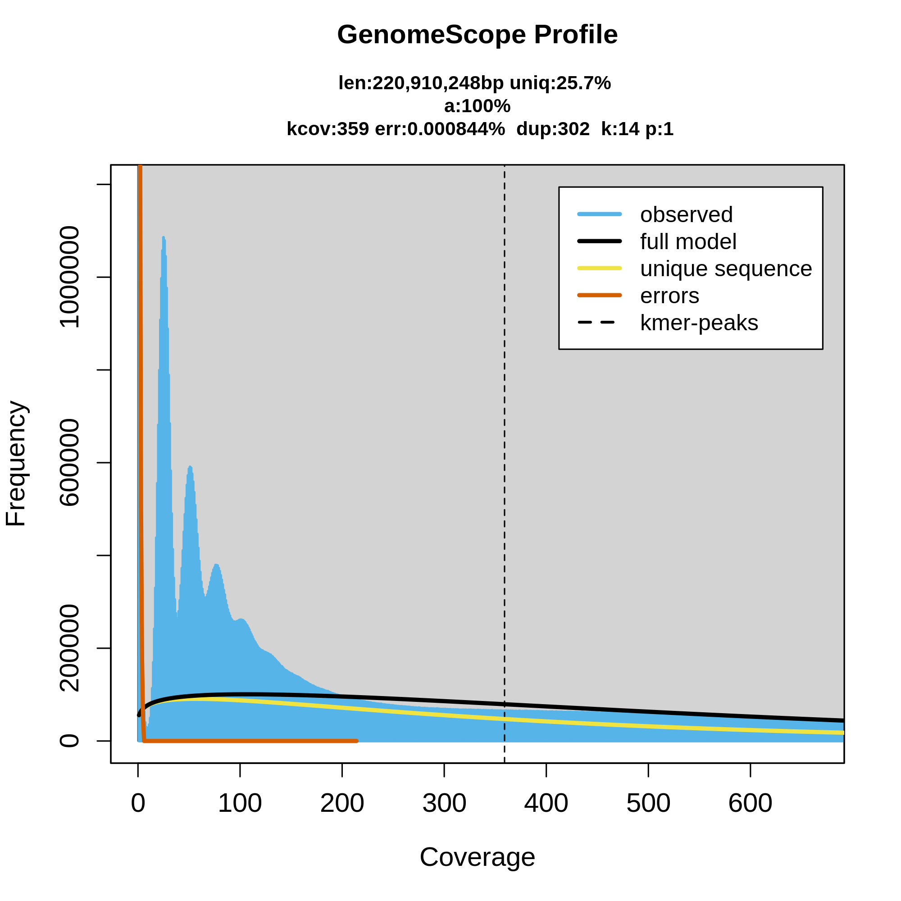 

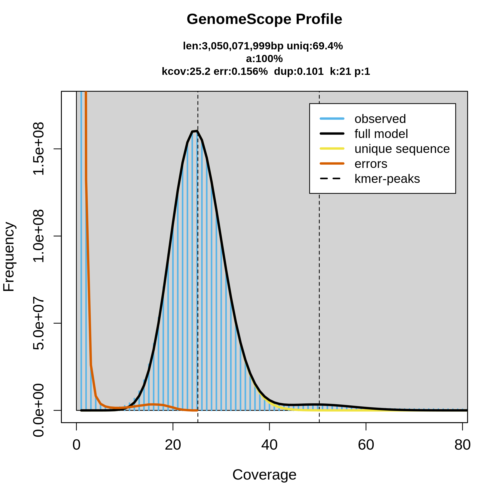  
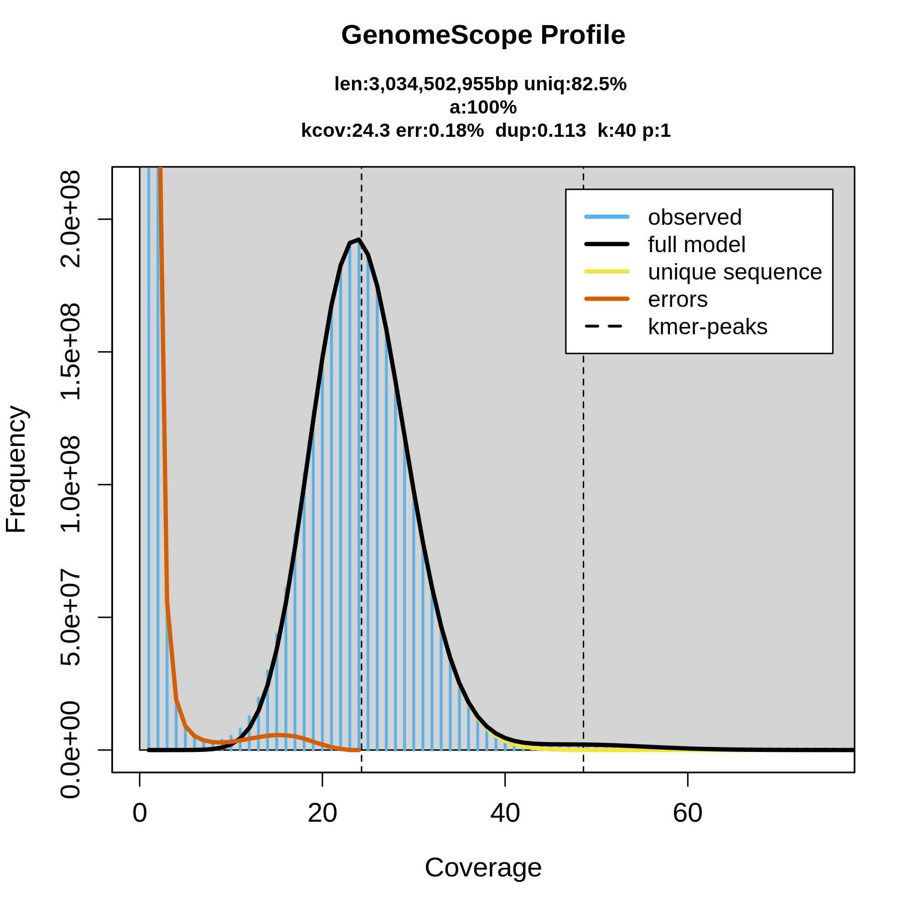 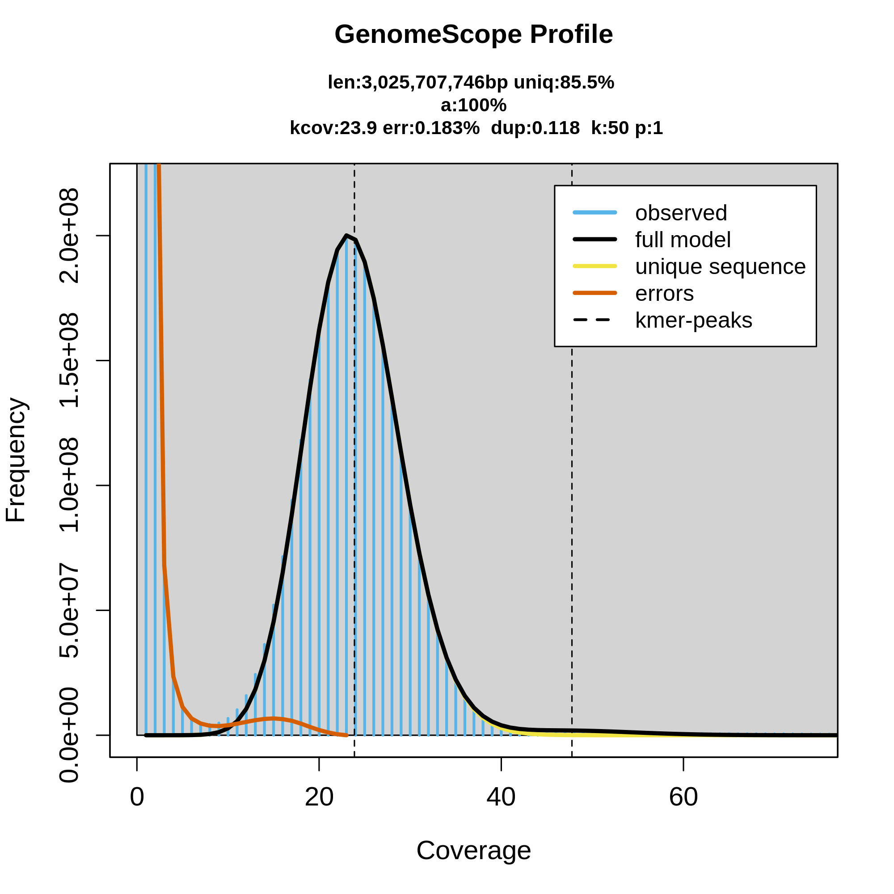

You should also have a look into the summary.txt file and check e.g. the Model Fit.

|K|property|min|max|
|:------|:-------|:----------|:-----------|
|14||||
||Homozygous (a)           |     100%            |  100%              |
||Genome Haploid Length    |     NA bp           |  220,910,248 bp    |
||Genome Repeat Length     |     133,323,184 bp  |  312,871,289 bp    |
||Genome Unique Length     |     24,199,950 bp   |  56,790,344 bp     |
||Model Fit                |     83.5568%        |  77.2201%          |
||Read Error Rate          |     0.000843612%    |  0.000843612% |
|21||||
||Homozygous (a)           |     100%             | 100%              |
||Genome Haploid Length    |     NA bp            | 3,050,071,999 bp  |
||Genome Repeat Length     |     933,823,180 bp   | 935,588,834 bp    |
||Genome Unique Length     |     2,113,370,754 bp | 2,117,366,671 bp  |
||Model Fit                |     85.0325%         | 98.2369%          |
||Read Error Rate          |     0.156079%        | 0.156079%  |
|31||||
||Homozygous (a)            |    100%             | 100%              |
||Genome Haploid Length     |    NA bp            | 3,042,852,748 bp  |
||Genome Repeat Length      |    659,451,745 bp   | 660,472,183 bp    |
||Genome Unique Length      |    2,381,050,379 bp | 2,384,734,825 bp  |
||Model Fit                 |    88.0608%         | 98.7253%          |
||Read Error Rate           |    0.173975%        | 0.173975%   |      
|40||||
||Homozygous (a)            |    100%             | 100%              |
||Genome Haploid Length     |    NA bp            | 3,034,502,955 bp  |
||Genome Repeat Length      |    531,800,927 bp   | 532,586,313 bp    |
||Genome Unique Length      |    2,500,464,591 bp | 2,504,157,383 bp  |
||Model Fit                 |    90.3732%         | 98.811%           |
||Read Error Rate           |    0.18018%         | 0.18018%     |     
|50||||
||Homozygous (a)             |   100%             | 100%              |
||Genome Haploid Length      |   NA bp            | 3,025,707,746 bp  |
||Genome Repeat Length       |   439,924,358 bp   | 440,562,852 bp    |
||Genome Unique Length       |   2,583,590,857 bp | 2,587,340,607 bp  |
||Model Fit                  |   91.4673%         | 99.0062%          |
||Read Error Rate            |   0.18283%         | 0.18283%   |


## Data set T2T 10x Genomics linked-reads

1. create kmer tables with FastK  

```bash 
cor=12
tim=12:00:00 
mem=50G
par=core
nam=FASTK_10x
acc="-A proj2022-5-333"
# reads CHM13*.fastq.gz
for k in 21 31 40
do 
   mkdir -p t2t_10x_k${k}
   pushd t2t_10x_k${k}
   cmd1="${SG} FastK -v -T${cor} -NT2T_10x_k${k} -bc23 -P$(pwd) -k${k} -t1 ../CHM13*.fastq.gz"
   sbatch -c ${cor} ${acc} -n 1 -p ${par} --mem=${mem} --time=${tim} -J ${nam}_k${k} --wrap="echo \"${cmd1}\" && ${cmd1}"
   popd
done
```

Run statistics

input read set: ~83G

|  K  |  walltime  | CPUtime | MemPeak (Gb) | storage (Gb)  |
|----:|:----------:|:-----------:|------------:|--------------:|
|  21 |   00:49:03 | 09:50:36    |     11.9    |      55       |
|  31 |   00:48:40 | 09:44:00    |     11.9    | **104**       |
|  40 |   01:00:08 | 12:01:00    |     12.7    |     **307**   |


2. run GeneScope.FK 

```bash 
cor=1
tim=02:00:00 
mem=10G
par=core
nam=GeneScope_10x
acc="-A proj2022-5-333"
for k in 21 31 40;  
do           
   pushd t2t_10x_k${k}
   cmd1="${SG} Histex -G T2T_10x_k${k} | ${SG} GeneScopeFK.R -o GeneS_T2T_10x_k${k} -p 1 -k ${k}"
   sbatch -c ${cor} ${acc} -n 1 -p ${par} --mem=${mem} --time=${tim} -J ${nam}_k${k} --wrap="echo \"${cmd1}\" && ${cmd1}"
   popd
done 
```

Results:

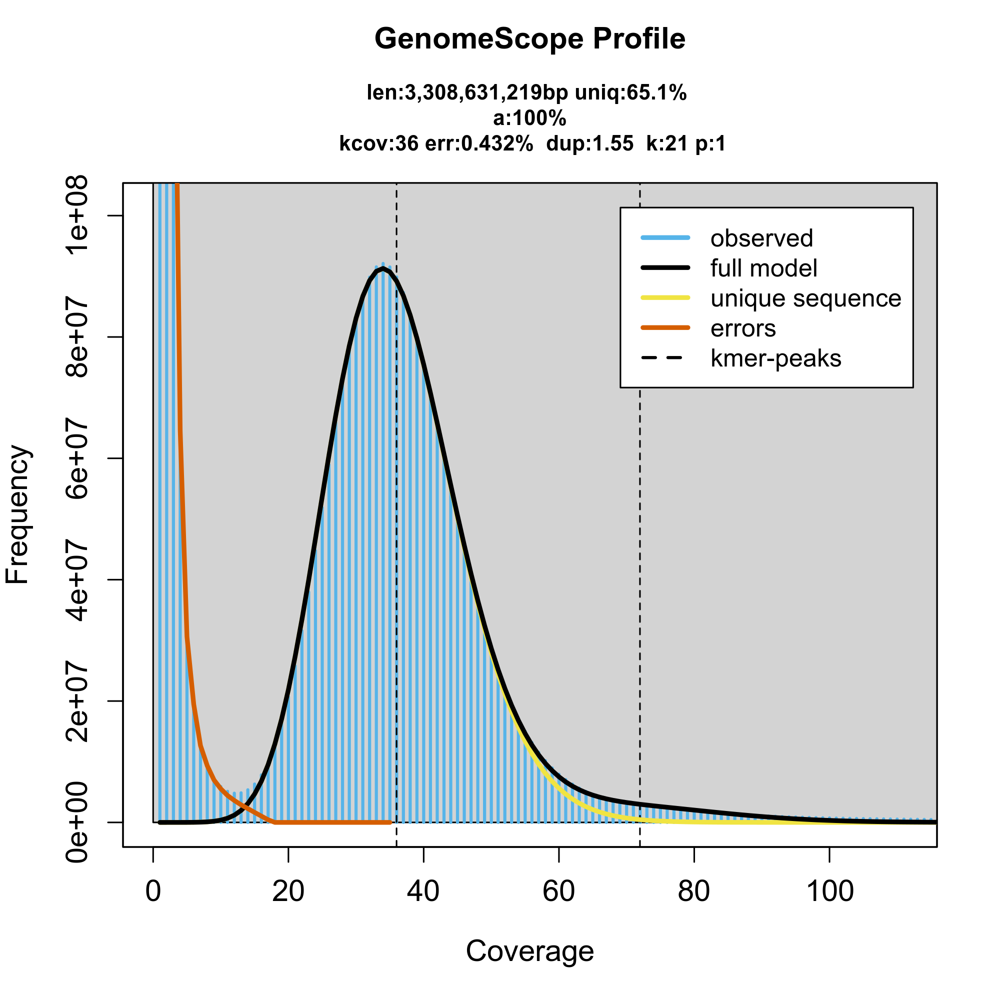  


|K|property|min|max|
|:------|:-------|:----------|:-----------|
|21||||
||Homozygous (a)               | 100%              |100%              |
||Genome Haploid Length        | NA bp             |3,308,631,219 bp  |
||Genome Repeat Length         | 1,156,353,418 bp  |1,159,010,673 bp  |
||Genome Unique Length         | 2,148,484,964 bp  |2,153,422,099 bp  |
||Model Fit                    | 87.4117%          |97.7723%          |
||Read Error Rate              | 0.43221%          |0.43221%          |
|31||||
||Homozygous (a)               | 100%              |100%              |
||Genome Haploid Length        | NA bp             |3,245,650,385 bp  |
||Genome Repeat Length         | 830,538,026 bp    |832,185,634 bp    |
||Genome Unique Length         | 2,411,899,398 bp  |2,416,684,087 bp  |
||Model Fit                    | 90.0334%          |98.4155%          |
||Read Error Rate              | 0.441063%         |0.441063%         |
|40||||
||Homozygous (a)               | 100%              |100%              |
||Genome Haploid Length        | NA bp             |3,206,298,867 bp  |
||Genome Repeat Length         | 667,922,294 bp    |669,419,717 bp    |
||Genome Unique Length         | 2,534,790,491 bp  |2,540,473,272 bp  |
||Model Fit                    | 91.2971%          |98.63%            |
||Read Error Rate              | 0.421776%         |0.421776%       |

## Data set T2T Illumina HiC 

1. create kmer tables with FastK  

```bash 
cor=12
tim=12:00:00 
mem=50G
par=core
nam=FASTK_hic
acc="-A proj2022-5-333"
# reads CHM13*.fastq.gz
for k in 21 31 40
do 
   mkdir -p t2t_hic_k${k}
   pushd t2t_hic_k${k}
   cmd1="${SG} FastK -v -T${cor} -NT2T_hic_k${k} -P$(pwd) -k${k} -t1 ../CHM13*.fastq.gz"
   sbatch -c ${cor} ${acc} -n 1 -p ${par} --mem=${mem} --time=${tim} -J ${nam}_k${k} --wrap="echo \"${cmd1}\" && ${cmd1}"
   popd
done
```

Run statistics

input read set: ~77G

|  K  |  walltime  | CPUtime | MemPeak (Gb) | storage (Gb)  |
|----:|:----------:|:-----------:|------------:|--------------:|
|  21 |   00:53:03 | 10:36:36    |     12.4    |      80       |
|  31 |   01:01:48 | 12:21:36    |     12.4    |      **150**   |
|  40 |   01:04:51 | 12:58:012   |     12.4    |      **218**   |


2. run GeneScope.FK 

```bash 
cor=1
tim=02:00:00 
mem=10G
par=gpu
nam=GeneScope_hic
acc="-A proj2022-5-333"
for k in 21 31 40;  
do           
   pushd t2t_hic_k${k}
   cmd1="${SG} Histex -G T2T_hic_k${k} | ${SG} GeneScopeFK.R -o GeneS_T2T_hic_k${k} -p 1 -k ${k}"
   sbatch -c ${cor} ${acc} -n 1 -p ${par} --mem=${mem} --time=${tim} -J ${nam}_k${k} --wrap="echo \"${cmd1}\" && ${cmd1}"
   popd
done 
```

Results:

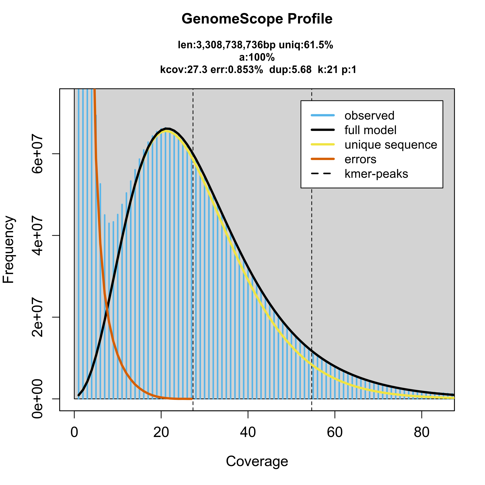 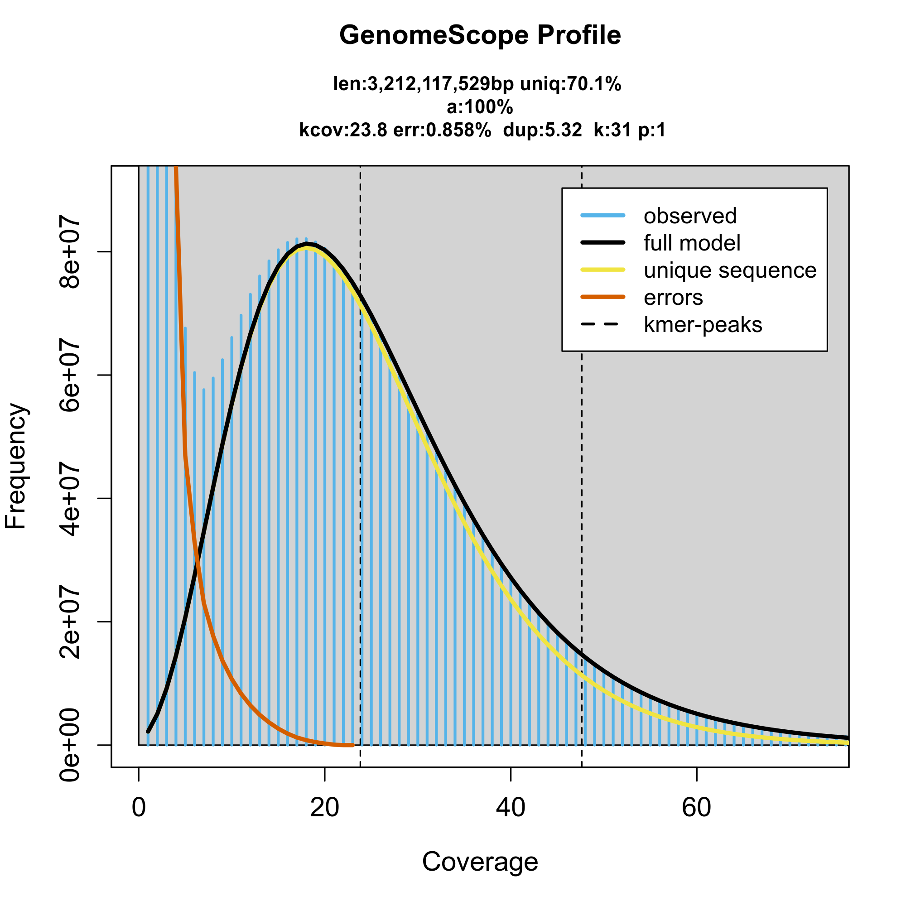 
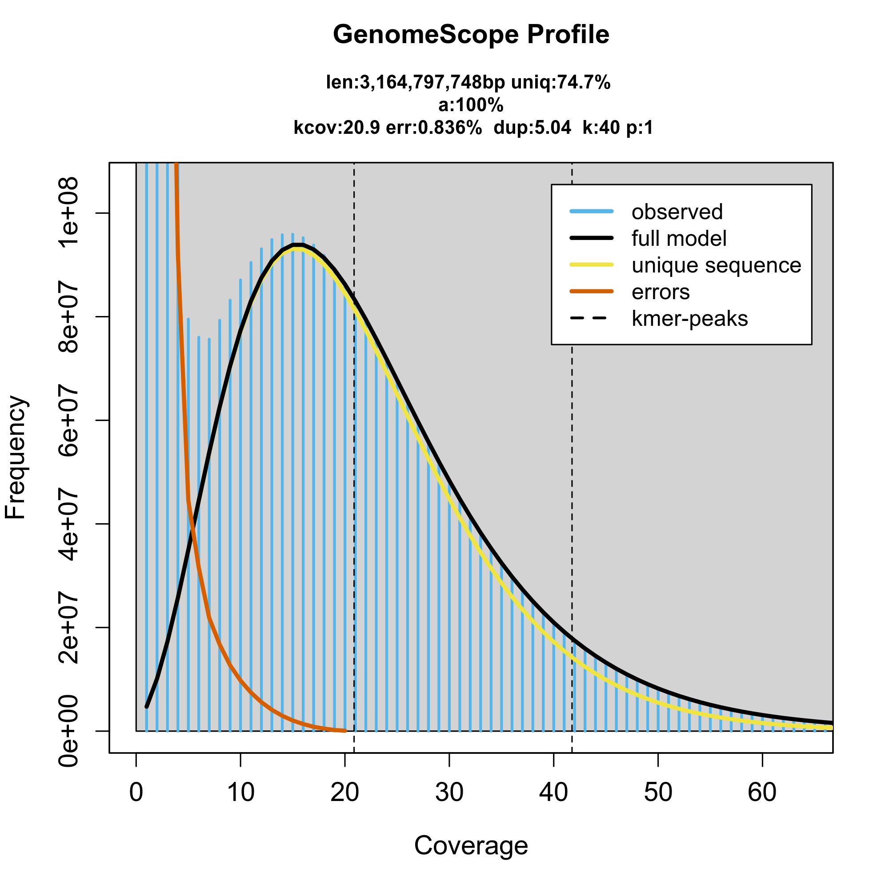


|K|property|min|max|
|:------|:-------|:----------|:-----------|
|21||||
||Homozygous (a)             |   100%             | 100%             | 
||Genome Haploid Length      |   NA bp            | 3,308,738,736 bp | 
||Genome Repeat Length       |   1,279,667,117 bp | 1,297,131,773 bp | 
||Genome Unique Length       |   2,006,797,096 bp | 2,034,185,485 bp | 
||Model Fit                  |   84.6351%         | 99.144%          | 
||Read Error Rate            |   0.8531%          | 0.8531%          | 
|31||||
||Homozygous (a)             |   100%             | 100%             | 
||Genome Haploid Length      |   NA bp            | 3,212,117,529 bp | 
||Genome Repeat Length       |   968,538,460 bp   | 979,732,383 bp   | 
||Genome Unique Length       |   2,225,229,059 bp | 2,250,947,237 bp | 
||Model Fit                  |   87.9462%         | 99.3901%         | 
||Read Error Rate            |   0.858227%        | 0.858227%        | 
|40||||
||Homozygous (a)             |   100%             | 100%             | 
||Genome Haploid Length      |   NA bp            | 3,164,797,748 bp | 
||Genome Repeat Length       |   814,026,590 bp   | 827,566,284 bp   | 
||Genome Unique Length       |   2,324,881,755 bp | 2,363,551,484 bp | 
||Model Fit                  |   89.3553%         | 99.476%          | 
||Read Error Rate            |   0.835978%        | 0.835978%        | 


**WARNING HiC data (OMNIC or Arima) is not usable for any kmer-based analysis. These data sets usually have high PCR dupliction biases, chimeric reads, and usually the genome is not fully covered (gaps)**

## Data set T2T Illumina 

1. create kmer tables with FastK  

```bash 
cor=12
tim=12:00:00 
mem=50G
par=core
nam=FASTK_ill
acc="-A proj2022-5-333"
# reads SRR1997411.fastq
#subsets=("SRR1997411.fastq" "SRR1997411.fastq SRR3189741.fastq" "SRR1997411.fastq SRR3189741.fastq SRR3189742.fastq" "SRR1997411.fastq SRR3189741.fastq SRR3189742.fastq SRR3189743.fastq")
# lets use only 25X and 50X subsets
subsets=("SRR1997411.fastq" "SRR1997411.fastq SRR3189741.fastq")
for k in 21 31 40
do 
   si=1
   for s in "${subsets[@]}"
   do
      mkdir -p t2t_ill_set${si}_k${k}
      pushd t2t_ill_set${si}_k${k}
      cmd1="${SG} FastK -v -T${cor} -NT2T_ill_set${si}_k${k} -P$(pwd) -k${k} -t1 $(echo "../$s" | sed -e "s: : ../:g")"
      sbatch -c ${cor} ${acc} -n 1 -p ${par} --mem=${mem} --time=${tim} -J ${nam}_k${k} --wrap="echo \"${cmd1}\" && ${cmd1}"
      popd
      si=$((si+1))
   done
done
```

Run statistics

input read set1: 60G


|  K  |  walltime  | CPUtime | MemPeak (Gb) | storage (Gb)  |
|----:|:----------:|:-----------:|------------:|--------------:|
|  21 |   00:32:54 | 06:34:36    |     12.2    |      58       |
|  31 |   00:47:00 | 09:24:00    |     12.2    |      **117**       |
|  40 |   00:47:07 | 09:25:24    |     38.6    |      **181**   |


input read set2: 120G

|  K  |  walltime  | CPUtime | MemPeak (Gb) | storage (Gb)  |
|----:|:----------:|:-----------:|------------:|--------------:|
|  21 |   00:57:42 | 11:32:24    |     12.2    |      **99**       |
|  31 |   01:23:10 | 16:38:00    |     15.2    |      **209**       |
|  40 |   01:27:39 | 17:31:47    |     71.5    |      **328**   |


2. run GeneScope.FK 

```bash 
cor=1
tim=02:00:00 
mem=10G
par=gpu
nam=GeneScope_hic
acc="" #-A proj2022-5-333"
for k in 21 31 40;  
do       
   for si in 1 2
   do    
      pushd t2t_ill_set${si}_k${k}
      cmd1="${SG} Histex -G T2T_ill_set${si}_k${k} | ${SG} GeneScopeFK.R -o GeneS_T2T_ill_set${si}_k${k} -p 1 -k ${k}"
      sbatch -c ${cor} ${acc} -n 1 -p ${par} --mem=${mem} --time=${tim} -J ${nam}_k${k} --wrap="echo \"${cmd1}\" && ${cmd1}"
      popd
   done
done 
```

Results input read set1:

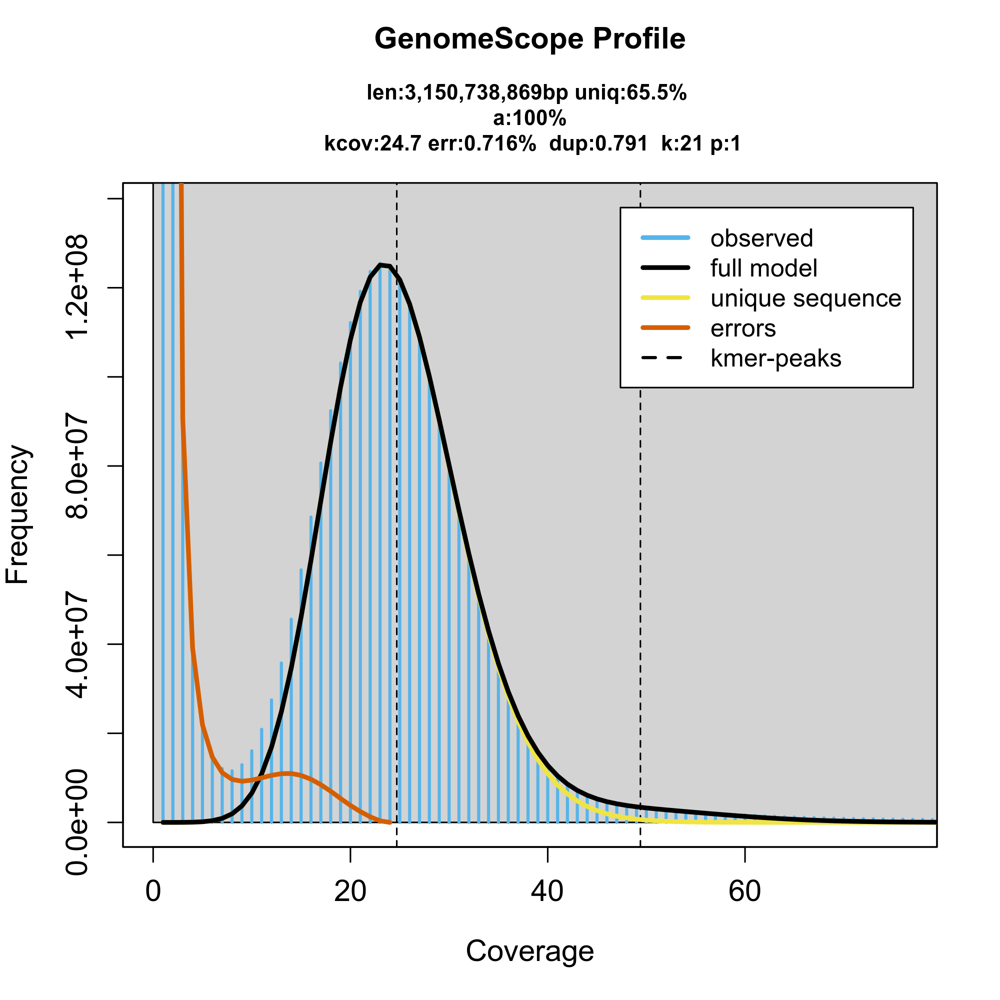 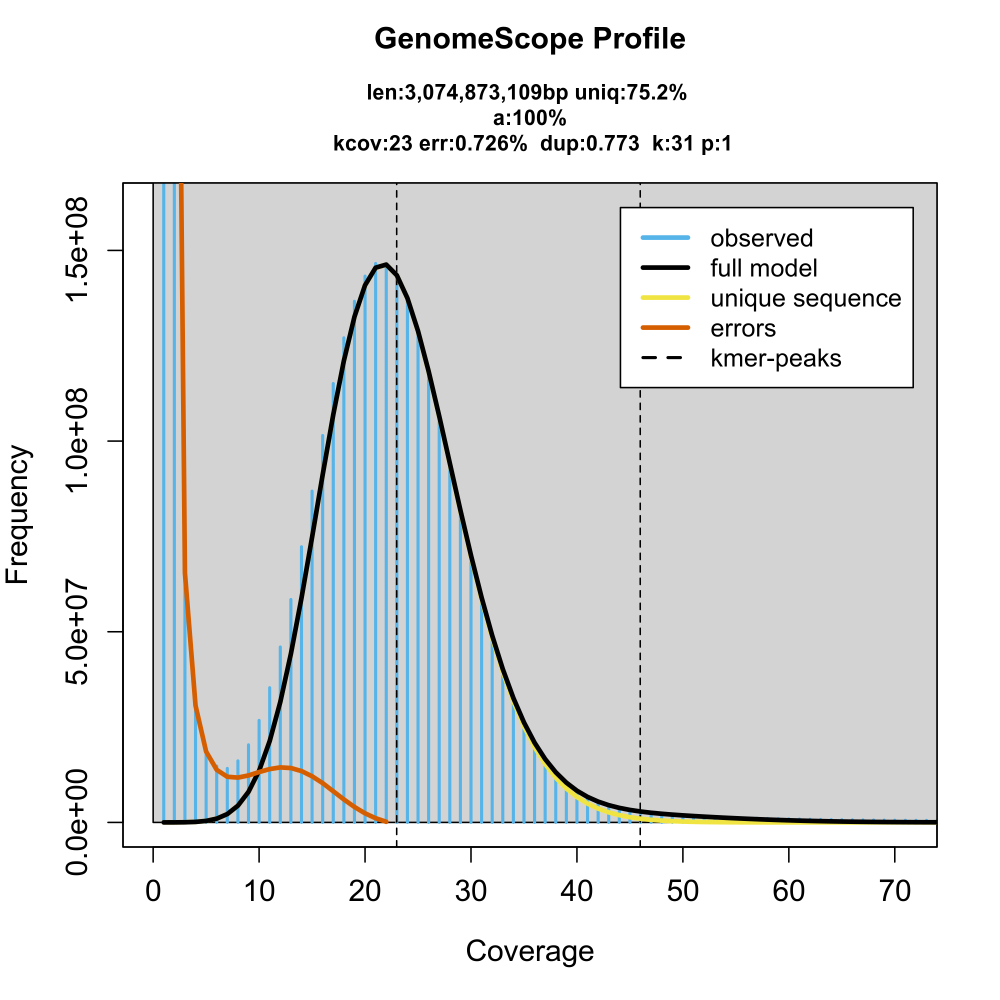
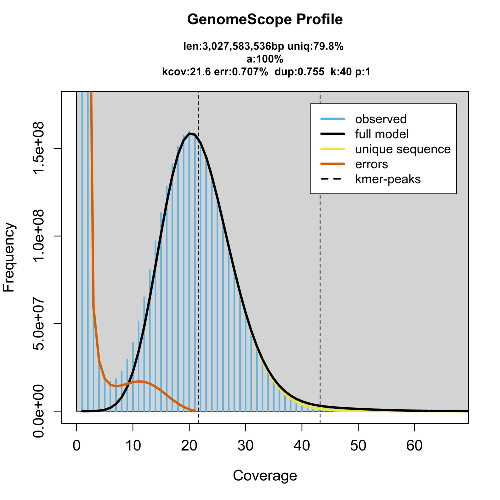


|K|property|min|max|
|:------|:-------|:----------|:-----------|
|21||||
||Homozygous (a)           |     100%             | 100%             | 
||Genome Haploid Length    |     NA bp            | 3,150,738,869 bp | 
||Genome Repeat Length     |     1,089,170,000 bp | 1,093,636,224 bp | 
||Genome Unique Length     |     2,055,135,328 bp | 2,063,562,567 bp | 
||Model Fit                |     82.5856%         | 97.9118%         | 
||Read Error Rate          |     0.716258%        | 0.716258%        | 
|31||||
||Homozygous (a)           |     100%             | 100%             | 
||Genome Haploid Length    |     NA bp            | 3,074,873,109 bp | 
||Genome Repeat Length     |     766,203,969 bp   | 768,787,501 bp   | 
||Genome Unique Length     |     2,303,502,542 bp | 2,311,269,628 bp | 
||Model Fit                |     87.3938%         | 98.6573%         | 
||Read Error Rate          |     0.72627%         | 0.72627%         | 
|40||||
||Homozygous (a)           |     100%             | 100%             | 
||Genome Haploid Length    |     NA bp            | 3,027,583,536 bp | 
||Genome Repeat Length     |     614,634,771 bp   | 616,567,261 bp   | 
||Genome Unique Length     |     2,408,204,129 bp | 2,415,775,829 bp | 
||Model Fit                |     89.1072%         | 98.7181%         | 
||Read Error Rate          |     0.706912%        | 0.706912%        | 


Results input read set2:

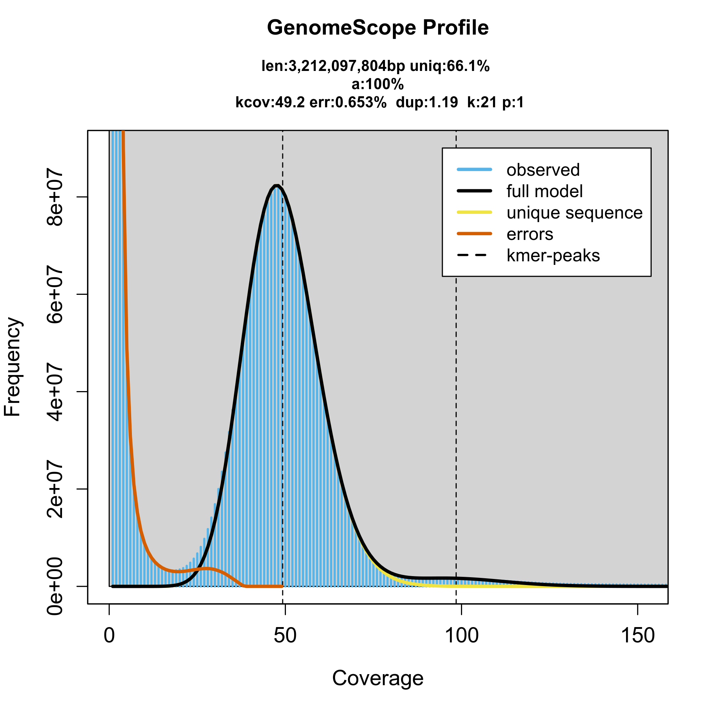 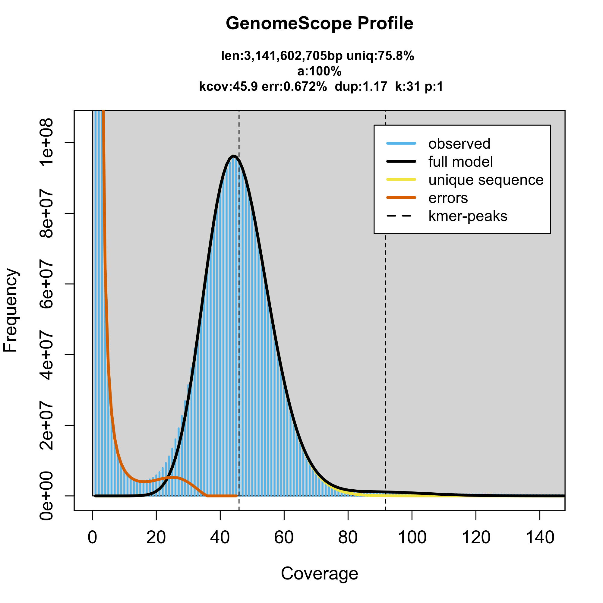
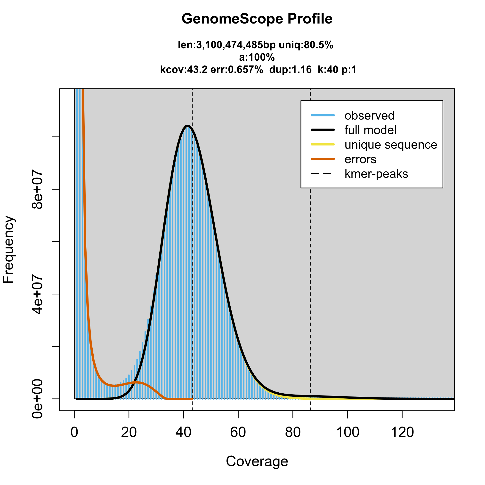


|K|property|min|max|
|:------|:-------|:----------|:-----------|
|21||||
||Homozygous (a)           |     100%             | 100%             | 
||Genome Haploid Length    |     NA bp            | 3,212,097,804 bp | 
||Genome Repeat Length     |     1,088,128,944 bp | 1,089,691,794 bp | 
||Genome Unique Length     |     2,121,665,444 bp | 2,124,712,734 bp | 
||Model Fit                |     87.62%           | 97.0024%         | 
||Read Error Rate          |     0.653126%        | 0.653126%        | 
|31||||
||Homozygous (a)           |     100%             | 100%             | 
||Genome Haploid Length    |     NA bp            | 3,141,602,705 bp | 
||Genome Repeat Length     |     759,825,802 bp   | 760,707,575 bp   | 
||Genome Unique Length     |     2,379,956,111 bp | 2,382,718,035 bp | 
||Model Fit                |     90.6415%         | 97.6199%         | 
|40||||
||Homozygous (a)           |     100%             | 100%             | 
||Genome Haploid Length    |     NA bp            | 3,100,474,485 bp | 
||Genome Repeat Length     |     605,102,777 bp   | 605,776,087 bp   | 
||Genome Unique Length     |     2,493,648,646 bp | 2,496,423,378 bp | 
||Model Fit                |     91.7214%         | 97.5765%         | 
||Read Error Rate          |     0.657062%        | 0.657062%        | 


## Data set tetraploid potato


## Data set simulated PacBio HiFi - reads


