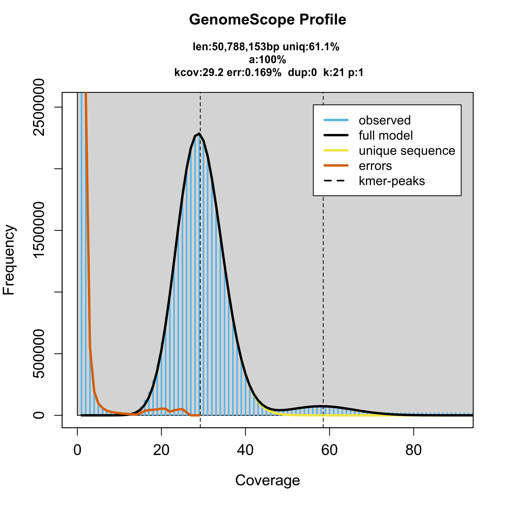
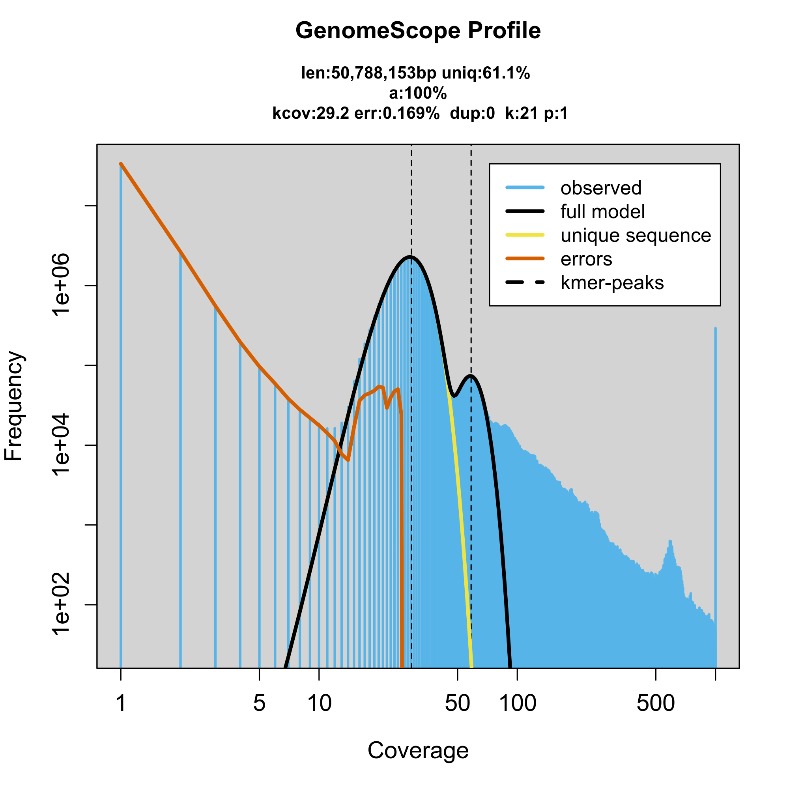
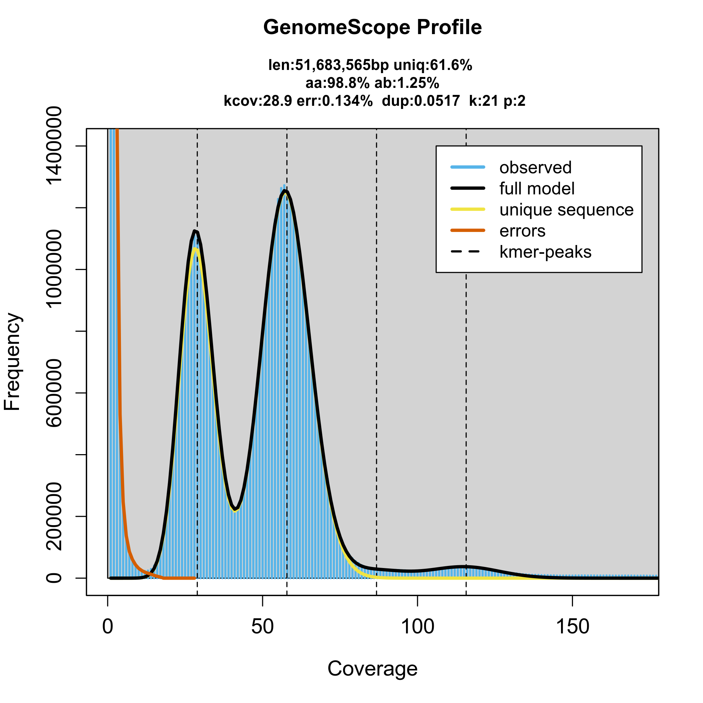
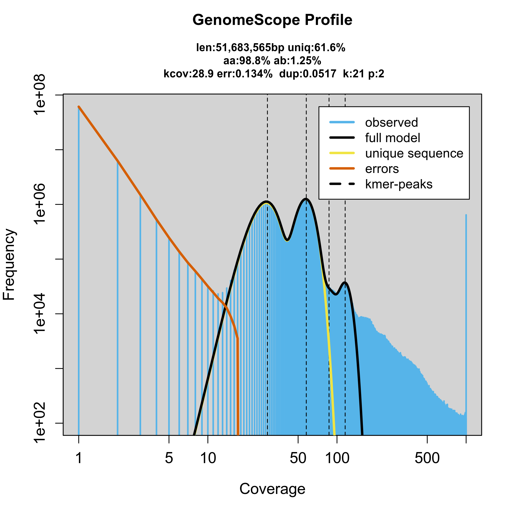
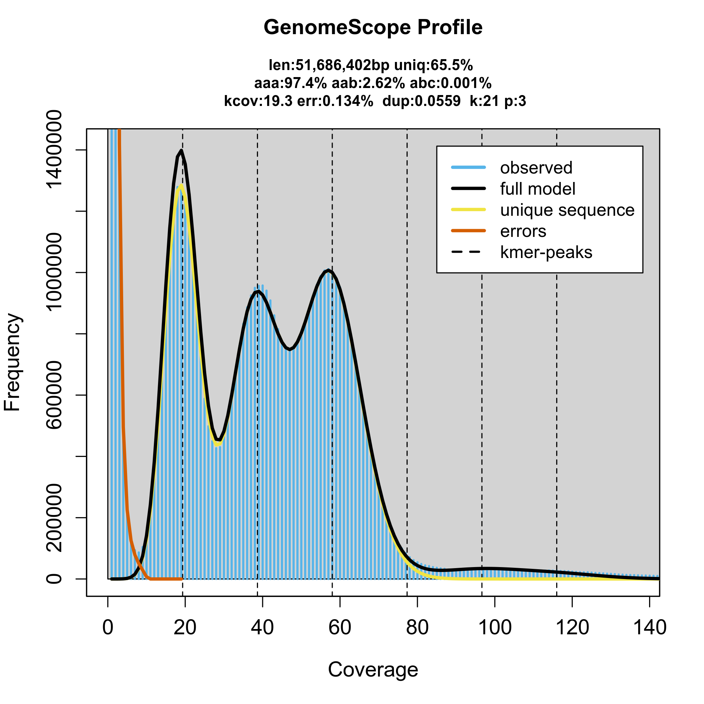
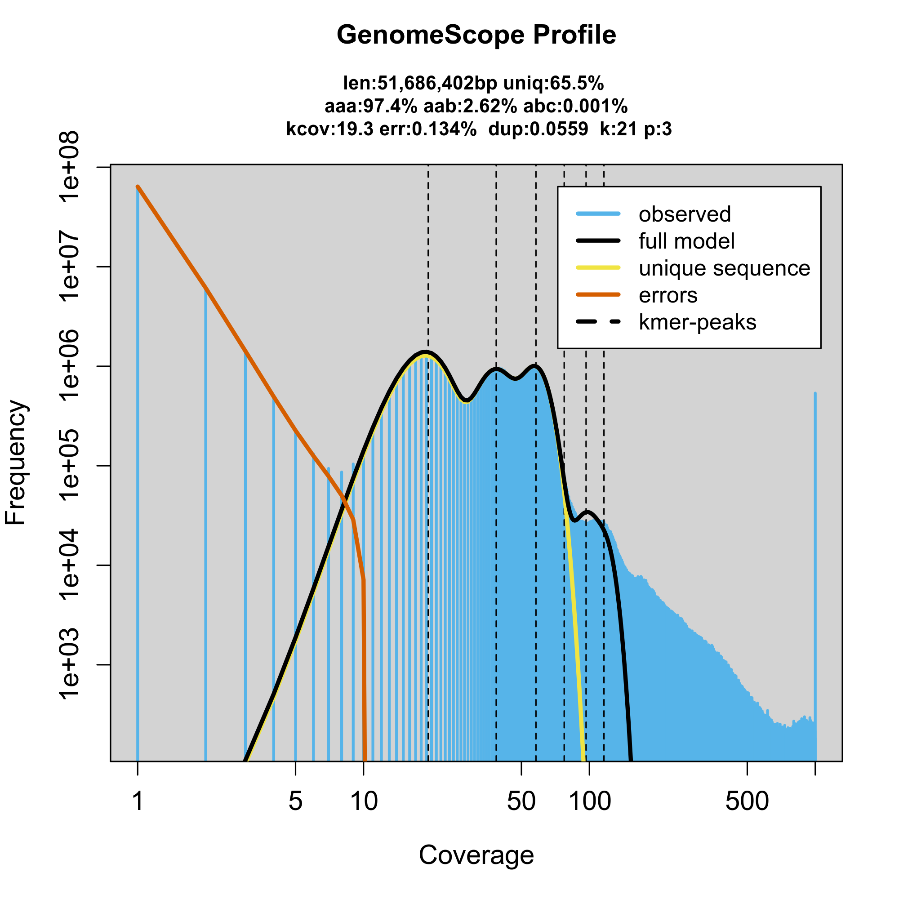
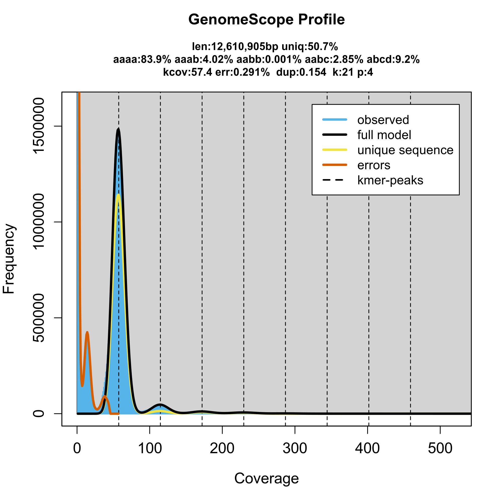
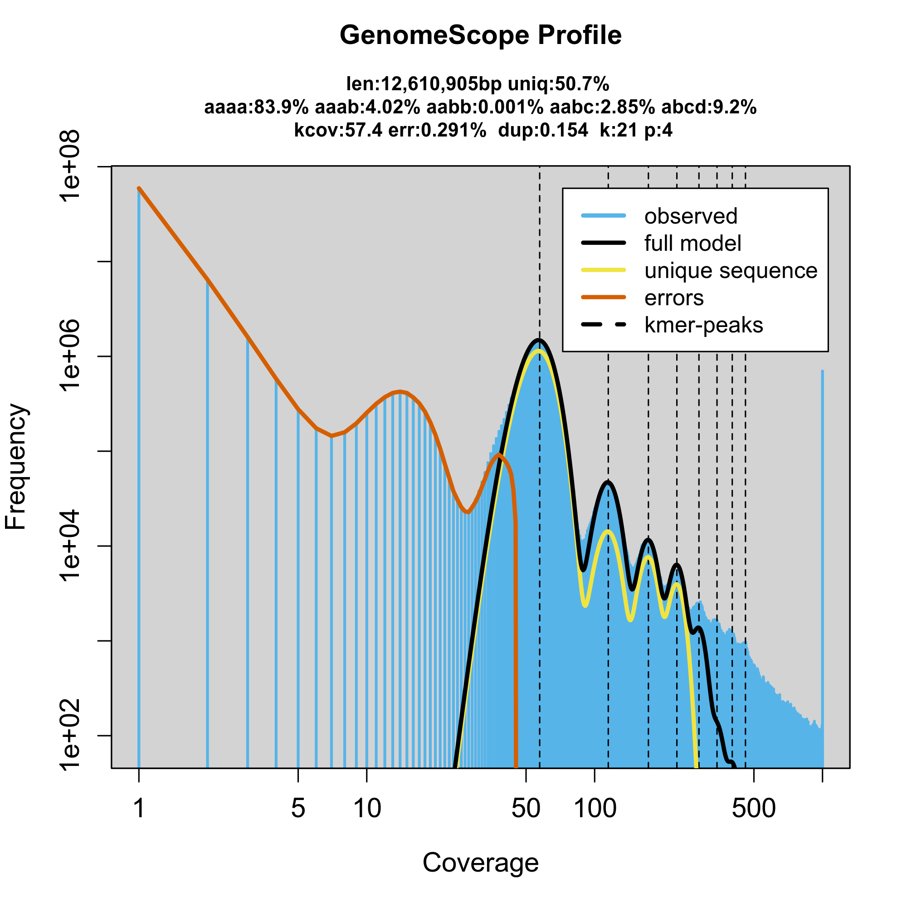

# simulated PacBio HiFi reads (polyploid)

Setup: 
 - use error and length model from Human T2T PacBio Project
 - average read length: 1685
 - minimum read length: 1000
 - standard deviation: s2412
 - use chromosome 22 as example (51.3Mb)

### haploid chr 22 data set  

create simulated read set with HIsim

```bash 
# coverage: 30
# mutation rate: .1%
HIsim chm13v2.0_noY.id_chr22.fa test2.model -h -e -f -p.1 -opbsim_chm13_chr22_hap_mut0.1_k21 -c30 -v -w100 -m16854 -s2412 -x1000
```

 

 

### diploid chr 22 data set 

```bash 
# coverage: 60
# mutation rate: .5%,.5%
HIsim chm13v2.0_noY.id_chr22.fa test2.model -h -e -f -p.5,.5 -osim_chm13_chr22_dip_mut.5.5 -c60 -v -w100 -m16854 -s2412 -x1000
```

 

 

### triploid chr 22 data set 

```bash 
# coverage: 60
# mutation rate: 1.6(0.1,0.1),.3
HIsim chm13v2.0_noY.id_chr22.fa  test2.model -h -e -f -p1.6\(0.1,0.1\),.3 -osim_chm13_chr22_tri_mut1.6-0.1_0.1-_.3 -c60 -v -w100 -m16854 -s2412 -x1000
```

 

 


### tetraploid chr 22 data set 

```bash 
# coverage: 60
# mutation rate: .5%,.5%
HIsim chm13v2.0_noY.id_chr22.fa test2.model -h -e -f -p.1,.1,.1,.1 -osim_chm13_chr22_tet_mut.1.1.1.1 -c60 -v -w100 -m16854 -s2412 -x1000
```

 

 
